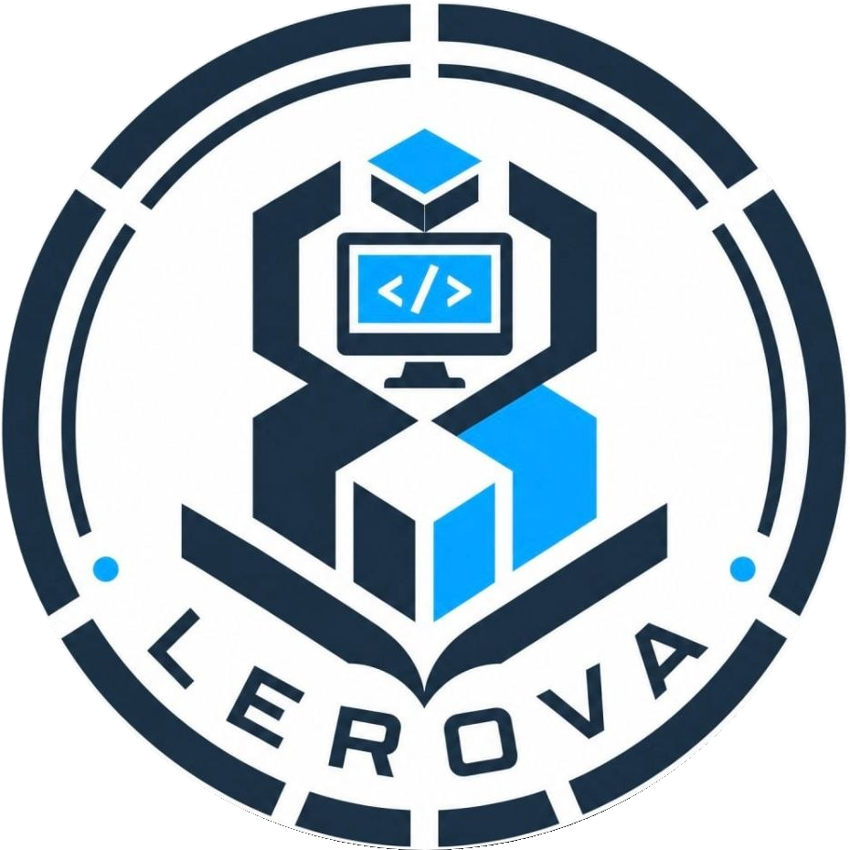

# LEROVA Team - Main Website

<p align="center">
  
</p>

الموقع الرسمي والمنصة التعريفية لفريق LEROVA للتقنية والابتكار، لعرض أهداف المبادرة والحلول البرمجية المبتكرة.

---

## رابط المعاينة المباشرة (Live Demo)

يمكنك زيارة الموقع المرفوع على منصة Vercel عبر الرابط التالي:
* **رابط المشروع:** [https://lerova-team.vercel.app](https://lerova-team.vercel.app) *(قم باستبدال هذا الرابط برابط Vercel الخاص بك)*

---

## أهداف الفريق (Team Objectives)

* تطوير حلول برمجية مبتكرة: بناء مشاريع وتطبيقات ويب متكاملة تتسم بالكفاءة والتصميم العصري.
* العمل الجماعي وتبادل الخبرات: تعزيز التعاون بين أعضاء الفريق لتبادل المهارات البرمجية والارتقاء بالمستوى التقني.
* إدارة المشاريع بكفاءة: اعتماد أفضل الممارسات في كتابة الكود النظيف (Clean Code) واستخدام أنظمة التحكم بالنسخ مثل Git وGitHub.
* بناء هوية تقنية مستقلة: إبراز مشاريع فريق LEROVA كمبادرة طلابية رائدة في مجال التكنولوجيا والابتكار.

---

## التقنيات المستخدمة (Tech Stack)

* اللغات الأساسية: HTML5, CSS3
* الاستضافة والصيانة: Vercel
* الأدوات وبيئة التطوير: VS Code, Git, GitHub

---

## فريق العمل (Contributors & Developers)

| العضو | الدور | الحساب / الملف الشخصي |
| :--- | :--- | :--- |
| **تاج الدين** | مطور | [@engtajaldeenalibri-](https://github.com/engtajaldeenalibri-) |
| **إستبرق بدر الدين** | مطورة | [@beriska-2](https://github.com/beriska-2/boky) |
| **منير احمد ناصر** | مطور | [@moneeralqwati-boop](https://github.com/moneeralqwati-boop) |
| **ريام** | مطورة | [@Rrymo](https://github.com/Rrymo) |
| **مصطفى علي** | مطور | [@mustafaalijumaa](https://github.com/mustafaalijumaa) |
| **روان** | مطورة | [@evara00](https://github.com/evara00) |
| **هاني القواتي** | مطور | [@hani-alqawati](https://github.com/hani-alqawati) |

---

## هيكلية المشروع (Project Structure)

```text
Lerova-team/
├── .vscode/               # إعدادات بيئة العمل
├── images/                # مجلد الصور والشعارات
│   ├── favicon.png
│   ├── moneerr.jpeg
│   ├── mustafa.jpeg
│   └── taj.jpeg
├── .gitignore             # ملف استبعاد الملفات غير المطلوبة
├── index.html             # الصفحة الرئيسية للموقع
└── style.css              # ملف التنسيقات والألوان
